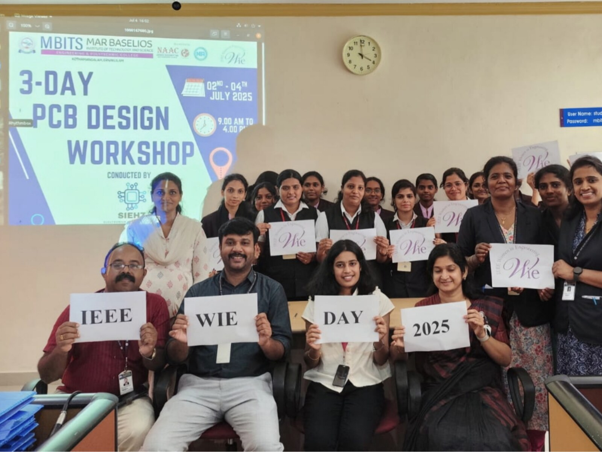

## Architecture
The project is a static website for the IEEE Computer Society MBITS Student Branch, designed with an ultra-minimalist, high-contrast editorial architecture inspired by **Pensatori Irrazionali**.

### Key System Components
1. **Precision Grid & Alignment Cadence**:
   - Fixed alignment guides and hairline borders (`var(--border-hairline)`).
   - Strict typography scale using Instrument Serif, Plus Jakarta Sans, and Space Mono.
2. **Navigation Header**:
   - Sticky translucent bar with backdrop filter, chapter status dot (`● ACTIVE`), index-tagged navigation links (`01 MANIFESTO` to `05 PROTOCOL`), and live IST timestamp.
3. **Hero Section**:
   - High-impact minimalist typography with serif italic highlights, synchronized live coordinate stamps, minimal vector nodal schematic, and clean metric pillars.
4. **Content Sections**:
   - High-contrast alternating rhythm:
     - § 01 / Manifesto (`.section--paper`, 3-column pillar grid)
     - § 02 / Calendar & Spec (`.section`, minimal tabular spec index + WebNova spotlight box)
     - § 03 / Visual Archive (`.section`, symmetric 16:10 cinema figure grid)
     - § 04 / Leadership Roster (`.section--paper`, Swiss technical title block)
     - § 05 / Join Protocol (`.section--dark`, minimalist split terminal)
5. **Footer Block**:
   - Watermark branding (`IEEE COMPUTER SOCIETY`), institutional triad lockup, live coordinates, and CAD revision stamp (`REV 2.1`).
6. **Static Asset Directory**:
   - `assets/logos/`: Vector SVG and transparent PNG brand marks for IEEE Master, IEEE Computer Society, and MBITS College.
   - `assets/gallery/`: Genuine high-resolution MBITS / IEEE CS event photos for Fig. 1 to Fig. 4.

---

## Feature Inventory

| # | Feature | Description | Milestone | Source |
|---|---------|-------------|-----------|--------|
| 1 | Official IEEE Master Logo | Vector SVG (`currentColor` adaptive) and transparent high-res PNG sourced from simple-icons/Wikimedia | M1 | Survey (explorer_web_sourcing_survey) |
| 2 | Official IEEE CS Logo | Official vector SVG and dark-background transparent PNG (white text + orange emblem) from computer.org | M1 | Survey (explorer_web_sourcing_survey) |
| 3 | Official MBITS College Logo | Official high-res transparent PNG crest and title emblem from mbits.ac.in | M1 | Survey (explorer_web_sourcing_survey) |
| 4 | Authentic Fig. 1 (PCB Workshop) | Genuine photo from MBITS lab PCB design workshop (wieevent.jpg), caption: Hands-on PCB design workshop, MBITS laboratories (Jul 2025) | M1 | Survey (explorer_web_sourcing_survey) |
| 5 | Authentic Fig. 2 (Hackathon Finals) | Genuine photo from MBITS Seminar Hall Smart India Hackathon finals (SIH.jpg), caption: Smart India Hackathon college finals, Seminar Hall (Sep 2025) | M1 | Survey (explorer_web_sourcing_survey) |
| 6 | Authentic Fig. 3 (Committee Assembly) | Genuine photo from MBITS Auditorium Tin-Her_Hack assembly (hack.jpg), caption: Student chapter committee and hackathon cohort assembly (Jan 2025) | M1 | Survey (explorer_web_sourcing_survey) |
| 7 | Authentic Fig. 4 (Technical Lecture) | Genuine photo from MBITS Auditorium Membership Development Conference (MDC.jpg), caption: Invited technical lecture and membership conference, Auditorium (Aug 2024) | M1 | Survey (explorer_web_sourcing_survey) |
| 8 | Header Nav Mark Integration | Single official IEEE CS mark + MBITS text mark in `.nav__mark` (<= 28px height) ensuring mobile clearance | M1 | Survey (explorer_codebase_survey) |
| 9 | Hero Triad Badge Integration | Institutional triad (IEEE Master, IEEE CS, MBITS) in `.hero__badge` within hero column with blueprint linework | M1 | Survey (explorer_codebase_survey) |
| 10 | Footer Branding Triad Integration | Formal institutional branding strip in footer alongside REV A — 2026 stamp | M1 | Survey (explorer_codebase_survey) |
| 11 | Gallery 4:3 Image & Caption Integration | Real photos replacing placeholder boxes in `.figure-grid`, figure margin reset, object-fit: cover, preserved Fig. 1–4 numbering | M1 | Survey (explorer_codebase_survey) |
| 12 | Design System & Animation Preservation | Strict single hero schematic draw-on animation only, zero hover-lifts on figures, 2 font families (IBM Plex), token palette adherence | M1 | Survey (spec_miner_survey) |
| 13 | Responsive Reflow Integrity | Flawless responsive scaling across desktop, 860px (hamburger nav, 2-col gallery), 720px (rulers hidden, padding reduced), and 360px mobile | M1 | Survey (spec_miner_survey) |

---

## Milestones

| # | Name | Scope | Dependencies | Status |
|---|------|-------|-------------|--------|
| 1 | Asset Sourcing & Blueprint Website Enhancement | Download official logos and authentic event photos to `assets/`, integrate logos into header/hero/footer, integrate photos into § A.4 gallery with updated captions, apply CSS styling for crisp rendering and responsive reflow without regressions | none | IN_PROGRESS |

---

## Interface Contracts

### Assets ↔ HTML / CSS Contract
- Logos location: `assets/logos/`
  - `ieee-master.svg` (adaptive SVG) and/or `ieee-master.png`
  - `ieee-cs.svg` and/or `ieee-cs-dark.png` (white text + orange mark for dark background)
  - `mbits-logo.png` (transparent crest/title)
- Gallery location: `assets/gallery/`
  - `fig1-workshop.jpg`
  - `fig2-hackathon.jpg`
  - `fig3-committee.jpg`
  - `fig4-lecture.jpg`
- Relative paths in `index.html`: `assets/logos/...` and `assets/gallery/...`

### HTML ↔ CSS Component Contracts
- **Header**: `<a class="nav__mark" href="#top"><span>MBITS</span></a>`
- **Hero Badge**: `<div class="hero__badge">` containing the 3 logos with border dividers using `var(--line-on-navy)`.
- **Gallery**:
  ```html
  <figure>
    <div class="figure__img">
      
    </div>
    <figcaption>Fig. 1 — Hands-on PCB design workshop, MBITS laboratories (Jul 2025)</figcaption>
  </figure>
  ```
- **CSS Grid & Figure Reset**:
  ```css
  .figure-grid figure {
    margin: 0;
  }
  .figure__img {
    aspect-ratio: 4 / 3;
    overflow: hidden;
    border: 1px solid var(--line-on-navy);
  }
  .figure__img img {
    width: 100%;
    height: 100%;
    object-fit: cover;
    display: block;
  }
  ```
- **Motion Invariant**:
  - No hover animations on `.figure__img` or `.figure__img img` (no `translateY`, no `scale`).
  - `.hero__diagram .draw` remains the only animated path element.

---

## Code Layout

- `/home/arshad/Projects/IEEE.Webpage/index.html` — Target HTML file
- `/home/arshad/Projects/IEEE.Webpage/css/styles.css` — Target stylesheet
- `/home/arshad/Projects/IEEE.Webpage/js/script.js` — Target script (read-only / preserved)
- `/home/arshad/Projects/IEEE.Webpage/assets/` — Dedicated static assets directory
  - `assets/logos/`
  - `assets/gallery/`
