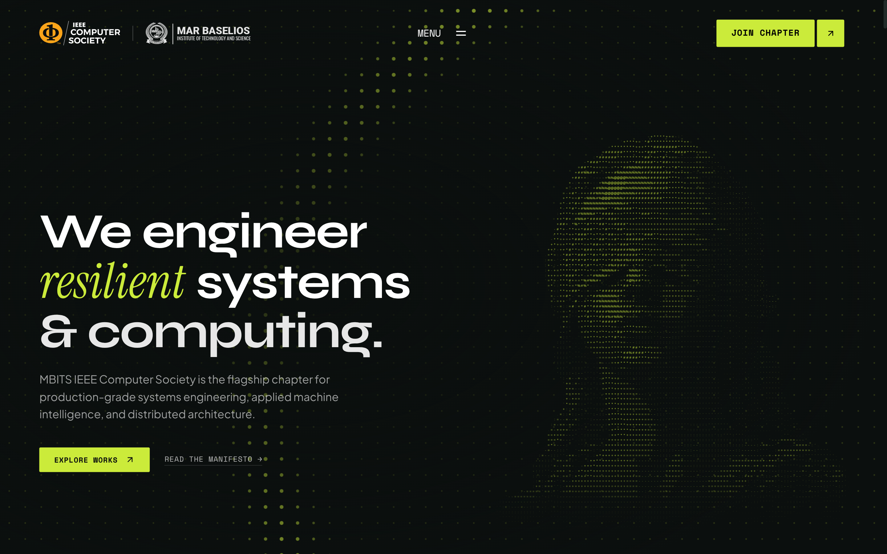

# IEEE Computer Society · MBITS

**Systems Architecture · Machine Intelligence · Cyber-Physical Security**

 

[**Explore Live Website ↗**](https://cigarfeine.github.io/IEEE.Webpage/)

 

---

### Overview

An editorial, high-performance web experience crafted for the **IEEE Computer Society Student Branch Chapter at MBITS**. Built with precision typography, kinetic scroll interactions, and real-time ASCII rendering to showcase initiatives across kernel architectures, machine learning infrastructure, and student engineering fellowships.

### Key Highlights

- **Kinetic Direction & Scroll Physics**: GSAP ScrollTrigger combined with Lenis smooth scrolling for organic, velocity-driven inertia.
- **Interactive Canvas ASCII Engine**: Dynamic ASCII rasterizer converting photography into real-time interactive ASCII matrices.
- **Good-Fella Editorial Layouts**: Fluid horizontal scroll rails, pin-aligned tab scrubbers, and responsive dual-state navigation overlays.
- **Autonomous Static CI/CD**: Automated GitHub Actions pipeline delivering zero-overhead static exports directly to GitHub Pages.

### Tech Stack

- **Framework**: Next.js 16 (App Router, Static Export)
- **Styling**: Tailwind CSS v4
- **Animation**: GSAP 3 + ScrollTrigger + Lenis
- **Typography**: Syne, Instrument Serif, Plus Jakarta Sans, Space Mono
- **Deployment**: GitHub Pages via GitHub Actions

---

© 2026 IEEE Computer Society MBITS Student Branch Chapter. Advancing technology for humanity.

